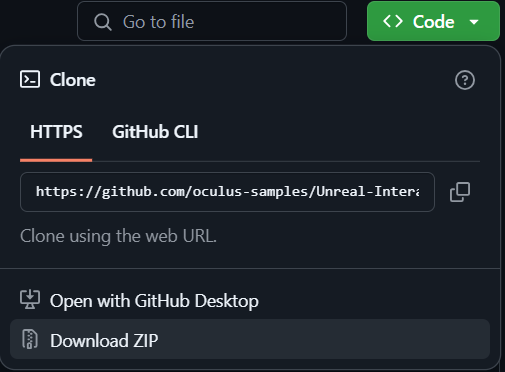
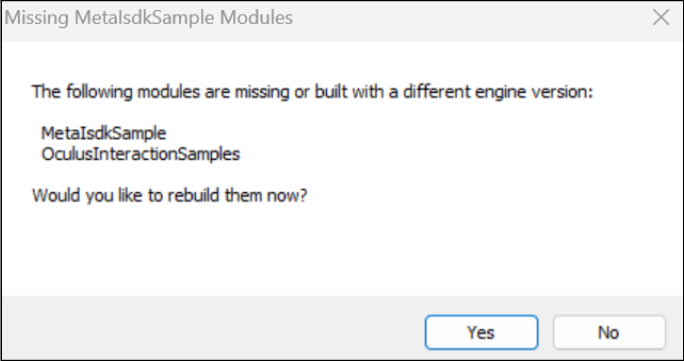
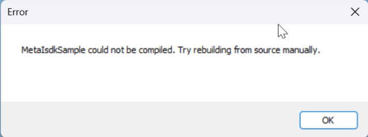

# InteractionSDK Sample

This sample demonstrates use of the [MetaXR Interaction SDK plugin](https://developers.meta.com/horizon/downloads/package/meta-xr-interaction-sdk-unreal/).

You must have Unreal Engine, the Meta XR plugin, and the Meta XR Interaction SDK plugin installed for this sample project to load correctly.  As this sample is a C++ project, you will also need to install and configure Visual Studio. See setup instructions below.

## Get the Sample Project

### Option 1. Download the Sample Project

Click the "Code" button at the top of this page and select "Download ZIP".



Unzip the downloaded file to proceed.

### Option 2. Clone the Sample Project Repository

First, ensure you have Git LFS installed by running this command:

```sh
git lfs install
```

Then, clone the repo using this command:

```sh
git clone https://github.com/oculus-samples/Unreal-InteractionSDK-Sample
```

## Get the Meta XR Plugin

Download the [Meta XR plugin](https://developer.oculus.com/downloads/package/unreal-engine-5-integration) and unzip the downloaded file into the `Plugins` directory of the Sample Project.

## Get the Meta XR Interaction SDK Plugin

Download the [Meta XR Interaction SDK plugin](https://developer.oculus.com/downloads/package/meta-xr-interaction-sdk-unreal) and unzip the downloaded file into the `Plugins` directory of the Sample Project.

## Get Unreal Engine

### Option 1: Epic Games Launcher with MetaXR plugins

The easiest way to get started is to use the prebuilt Unreal Engine from the Epic Games Launcher.

1. Install the [Epic Games Launcher](https://www.epicgames.com/store/en-US/download)
2. From the launcher, install the latest version Unreal Engine 5

### Option 2: Meta fork of Epic’s Unreal Engine

The Meta fork of Epic’s Unreal Engine will give you the most up to date integration of Oculus features and engine optimizations. However, it requires a more complicated and time-consuming setup flow, outlined below.  For more information, see the [Meta Unreal Engine Fork Documentation](https://developers.meta.com/horizon/documentation/unreal/unreal-compatibility-matrix).

Follow the instructions on [Accessing Unreal Engine source code on GitHub](https://www.unrealengine.com/en-US/ue-on-github) to obtain:

- an Epic account
- a GitHub account
- authorization to access the Unreal Engine source repository

Disregard instructions on downloading Epic’s Unreal Engine source code as you will be building the Meta fork of Epic’s Unreal Engine source.

1. Download the source code from the [Meta fork of Epic’s Unreal Engine on GitHub](https://github.com/Oculus-VR/UnrealEngine).
2. Follow Epic’s instructions on [Building Unreal Engine from Source](https://docs.unrealengine.com/5.2/en-US/building-unreal-engine-from-source/) to complete the process.

Note that this build may take a while to complete.

## Get Visual Studio

Refer to Epic's [Visual Studio Setup Documentation](https://dev.epicgames.com/documentation/en-us/unreal-engine/setting-up-visual-studio-development-environment-for-cplusplus-projects-in-unreal-engine) for:

- Guidance on which version of Visual Studio to download
- Instructions on how to set up Visual Studio for first-time users

[Download Visual Studio](https://visualstudio.microsoft.com/downloads/) and follow Epic's instructions, above, for setting it up to work with Unreal Engine.

If you already have Visual Studio installed:

- Launch the Visual Studio Installer and click Modify for the Visual Studio version you want to use.
- Under the Workloads tab, make sure "Game development with C++" is checked - if it isn't, check it and click Modify.

## Build and Launch the Sample Project

1. Right click on `MetaIsdkSample.uproject`, select 'Generate Visual Studio project files'
2. Open the `MetaIsdkSample.sln` file in Visual studio
3. Within Visual Studio, select 'Start without debugging' from the 'Debug' menu.

## Documentation

To find out more about plugin features, see the [Meta XR Interaction SDK documentation](https://developers.meta.com/horizon/documentation/unreal/unreal-isdk-overview).

## Troubleshooting

### Modules "Built with a different engine version"



This message pops up when attempting to launch the sample project through the Epic Games launcher or via the sample project's .uproject file.

If you have Visual Studio correctly installed and configured, you can click "Yes" to build the sample project and plugins, and proceed normally.

If you do not have Visual Studio correctly installed and configured, you may get the following message when rebuilding:



If you encounter this message, revisit the Visual Studio installation steps, above.

## Licenses

The Meta License applies to the SDK and supporting material. The MIT License applies to only certain, clearly marked documents. If an individual file does not indicate which license it is subject to, then the Meta License applies.
